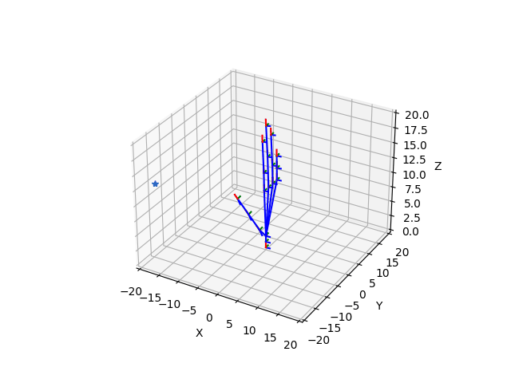

# Inverse Kinematics 
Dynamically create the geometry of a robot and apply IK onto it 

## Requirements 

in order to install the libs required by this tool

```shell 
pip3 install -r requirements.txt
```

### Python version
```shell 
python 3.*
```

## Configuration
The configs files (/resources/configs/*.yml) allow to dynamically create the robot structure (in the template below it is provided the example of a robot arm with 2 joints). In this tool a robot is considered as a set of bones connected by joints.

#### Config structure
``` yaml
Joints:  
    - id: 0
      actuators:     
          - type: ROTARY_ACTUATOR
            axis: 0
            start_angle: 0
            constraints:         
              min: -.inf 
              max: .inf
    - id: 1
      actuators: 
          - type: ROTARY_ACTUATOR
            axis: 0
            start_angle: 0
            constraints:         
              min: -.inf 
              max: .inf
    - id: 2
      actuators: []
Geometry:
  vertices:
      coords: [
        [0, 0, 0],
        [0, 0, 10],
        [0, 0, 20]    
      ]
      angles: [
        [0, 0, 0],
        [0, 0, 0],
        [0, 0, 0]    
      ]
  edges: [
    [1], [2], []
  ]
```

+ **Joints**: contains the list of joints.
    + **id**: numeric value (starting from index 0) that allows to map that joint into the robot geometry.
    + **actuators**: list of actuators associate to a joint.
      - **type**: type of actuator considered (only ROTARY_ACTUATOR is yet implemented)
        - **axis**: id of the joint basis axis considered as axis of rotation ([0, 1, 2] respectivelly x, y and z). 
        - **start_angle**: displacement (in terms of angle) from the zero position.
        - **contraints**: maximum and the minimum angles appliable by the actuator.

+ **Geometry**: contains informations about the robot geometry.
    + **vertices**:
      - **coords**: list of vectors describing the initial position of each joint (the joint id allows to map each joint to its location).
      - **angles**: displacement (in terms of angles) from the default alignment of the joint.      
    + **edges**: adjacency list representing the actual connection of the vertices (joints).

## Default joint basis alignment
the joint basis is aligned such that the z axis is the vector from the joint location to the child joint location (following the edges structure specified in the configuration file). If a joint have multiple childs than the mean of their locations is considered. 

## Execution
+ use yaml templates (contained in /resources/configs/) or create your custom configuration file.
+ set variable **CONFIG_PATH** into ***main.py***.
```python                    

CONFIG_PATH = os.path.join('.', 'resources', 'configs', 'armConfig - 3 joints.yml')

if __name__ == "__main__":    
    arm = ArmConfigParser(path=CONFIG_PATH).parse()    
```
+ execute the inverse_kinematics method:\
  where:
    - **target**: location of the target (numpy array)
    - **joints_id**: list of the ids corresponding to the joints that have to reach the target (in other words this is the subset of joints whose location is used in the cost function). 
    - **lr**: learning rate 
```python
robot.inverse_kinematics(target=np.array([x, y, z]), joints_id=id, lr=.0001)
```  

### Examples 
+ open file main.py
+ decomment the selected example  
+ run:

```shell 
python main.py
```

\
2 joints unconstrained\
 


3 joints unconstrained\
 


3 joints constrained\
 


hand\
 